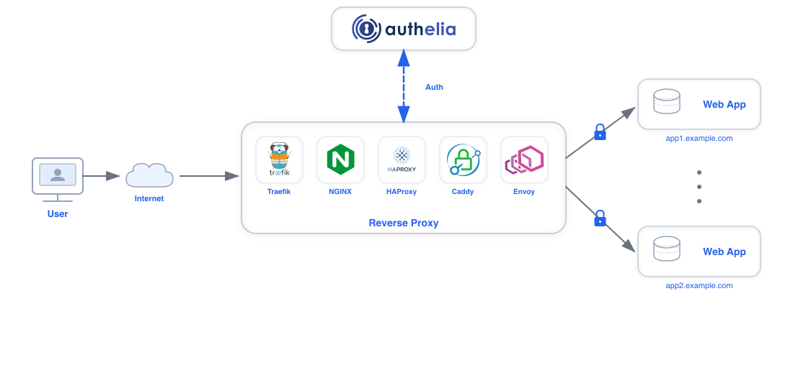
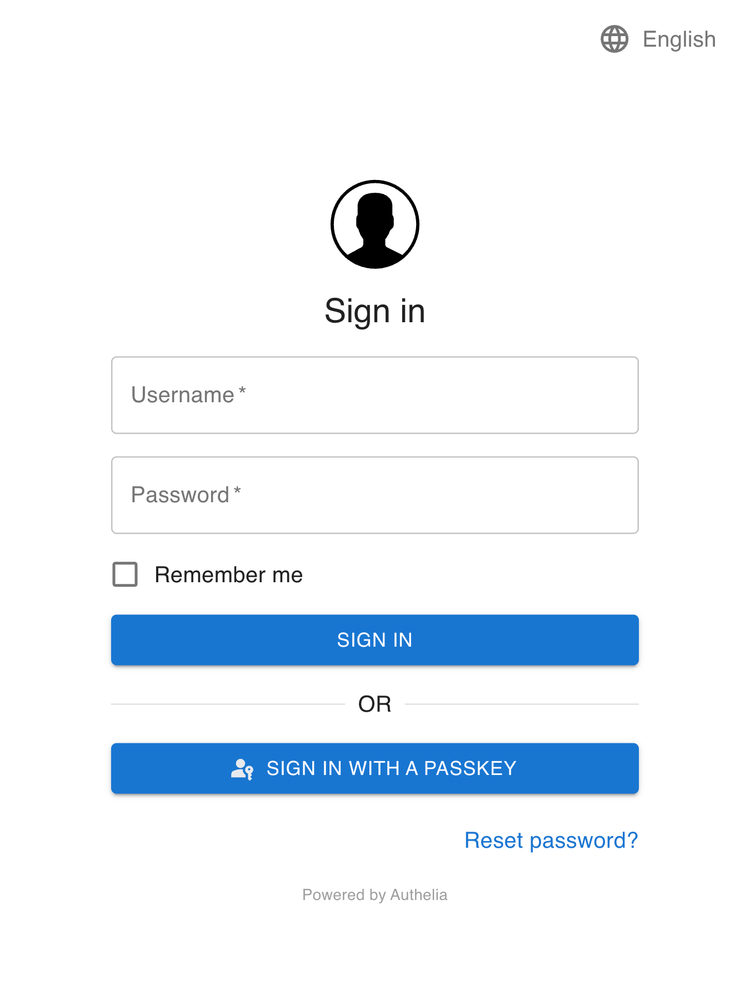
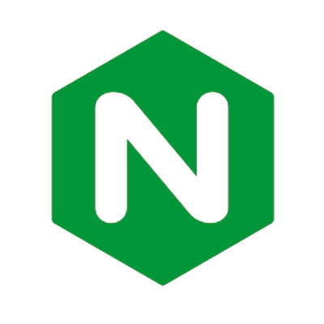
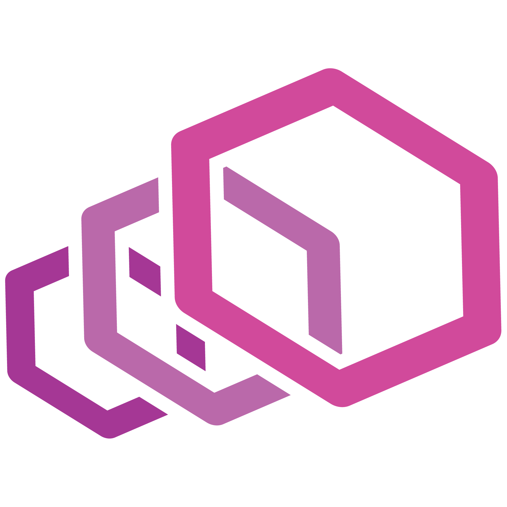

  

  
  
  
  
  
  
  
  
  [][Apache 2.0]
  
  
  

**Authelia** is an open-source authentication and authorization server providing two-factor authentication and single
sign-on (SSO) for your applications via a web portal. It acts as a companion for reverse proxies like [nginx],
[Traefik], [caddy] or [HAProxy] to let them know whether requests should either be allowed or redirected to Authelia's
portal for authentication.

Documentation is available at [https://www.authelia.com/](https://www.authelia.com/).

The following is a simple diagram of the architecture:

  

**Authelia** can be installed as a standalone service from the [AUR](https://aur.archlinux.org/packages/authelia/),
[APT](https://apt.authelia.com/stable/debian/packages/authelia/),
[FreeBSD Ports](https://svnweb.freebsd.org/ports/head/www/authelia/), or using a
[Static binary](https://github.com/authelia/authelia/releases/latest),
[.deb package]((https://github.com/authelia/authelia/releases/latest)), [Docker] or [Kubernetes] either manually or via
the Helm [Chart](https://charts.authelia.com) (beta) leveraging ingress controllers and ingress configurations.

  
  

Here is what Authelia's portal looks like:

  
  

## Features summary

This is a list of the key features of Authelia:

* Several second factor methods:
  * **[Security Keys](https://www.authelia.com/overview/authentication/webauthn-security-key/)** that support
    [FIDO2]&nbsp;[Webauthn] with devices like a [YubiKey].
  * **[Time-based One-Time password](https://www.authelia.com/overview/authentication/one-time-password/)**
    with compatible authenticator applications.
  * **[Mobile Push Notifications](https://www.authelia.com/overview/authentication/push-notification/)**
    with [Duo](https://duo.com/).
* Password reset with identity verification using email confirmation.
* Access restriction after too many invalid authentication attempts.
* Fine-grained access control using rules which match criteria like subdomain, user, user group membership, request uri,
 request method, and network.
* Choice between one-factor and two-factor policies per-rule.
* Support of basic authentication for endpoints protected by the one-factor policy.
* Highly available using a remote database and Redis as a highly available KV store.
* Compatible with [Traefik](https://doc.traefik.io/traefik) out of the box using the
  [ForwardAuth](https://doc.traefik.io/traefik/middlewares/http/forwardauth/) middleware.
* Curated configuration from [LinuxServer](https://www.linuxserver.io/) via their
  [Swag](https://docs.linuxserver.io/general/swag) container as well as a
  [guide](https://blog.linuxserver.io/2020/08/26/setting-up-authelia/).
* Compatible with [caddy] using the [forward_auth](https://caddyserver.com/docs/caddyfile/directives/forward_auth)
  directive.
* Kubernetes Support:
  * Compatible with the [ingress-nginx](https://github.com/kubernetes/ingress-nginx), the
    [Traefik Kubernetes CRD](https://doc.traefik.io/traefik/providers/kubernetes-crd/), and the
    [Traefik Kubernetes Ingress](https://doc.traefik.io/traefik/providers/kubernetes-crd/) Kubernetes ingress
    controllers out of the box.
  * Beta support for installing via Helm using our [Charts](https://charts.authelia.com).
* Beta support for [OpenID Connect](https://www.authelia.com/roadmap/active/openid-connect/).

For more details take a look at the [Overview](https://www.authelia.com/overview/prologue/introduction/).

If you want to know more about the roadmap, follow [Roadmap](https://www.authelia.com/roadmap).

## Proxy support

Authelia works in combination with [nginx], [Traefik], [caddy] or [HAProxy]. It can be deployed on bare metal with
Docker or on top of [Kubernetes].

  
  
  
  
  

***Help Wanted:*** Assistance would be appreciated in getting Authelia working with
[Envoy](https://www.envoyproxy.io/).

  

## Getting Started

See the [Get Started Guide](https://www.authelia.com/integration/prologue/get-started/) or one of the curated examples
below.

### docker-compose

The `docker-compose` bundles act as a starting point for anyone wanting to see Authelia in action. You will have to
customize them to your needs as they come with self-signed certificates.

#### [Local](https://www.authelia.com/integration/deployment/docker/#local)
The Local compose bundle is intended to test Authelia without worrying about configuration.
It's meant to be used for scenarios where the server is not be exposed to the internet.
Domains will be defined in the local hosts file and self-signed certificates will be utilised.

#### [Lite](https://www.authelia.com/integration/deployment/docker/#lite)
The Lite compose bundle is intended for scenarios where the server will be exposed to the internet, domains and DNS will
need to be setup accordingly and certificates will be generated through LetsEncrypt. The Lite element refers to minimal
external dependencies; File based user storage, SQLite based configuration storage. In this configuration, the service
will not scale well.

## Deployment

Now that you have tested **Authelia** and you want to try it out in your own infrastructure,
you can learn how to deploy and use it with [Deployment](https://www.authelia.com/docs/deployment/deployment-ha).
This guide will show you how to deploy it on bare metal as well as on
[Kubernetes](https://kubernetes.io/).

## Security

Authelia takes security very seriously. If you discover a vulnerability in Authelia, please see our
[Security Policy](https://github.com/authelia/authelia/security/policy).

For more information about [security](https://www.authelia.com/information/security/) related matters, please read
[the documentation](https://www.authelia.com/information/security/).

## Contact Options

Several contact options exist for our community, the primary one being [Matrix](#matrix). These are in addition to
[GitHub issues](https://github.com/authelia/authelia/issues) for creating a
[new issue](https://github.com/authelia/authelia/issues/new/choose).

### Matrix

Community members are invited to join the [Matrix Space](https://matrix.to/#/#community:authelia.com) which includes
both the [Support Room](https://matrix.to/#/#support:authelia.com) and the
[Contributing Room](https://matrix.to/#/#contributing:authelia.com).

- The core team members are identified as administrators in the Space and individual Rooms.
- All channels are linked to [Discord](#discord).

### Discord

Community members are invited to join the [Discord Server](https://discord.authelia.com).

- The core team members are identified by the **CORE TEAM** role in Discord.
- The [#support] and [#contributing] channels are linked to [Matrix](#matrix).

### Email

You can contact the core team by email via [team@authelia.com](mailto:team@authelia.com). Please note the
[security@authelia.com](mailto:security@authelia.com) is also available but is strictly reserved for [security] related
matters.

## Breaking changes

Since Authelia is still under active development, it is subject to breaking changes. It's recommended to pin a version
tag instead of using the `latest` tag and reading the [release notes](https://github.com/authelia/authelia/releases)
before upgrading. This is where you will find information about breaking changes and what you should do to overcome
said changes.

## Why Open Source?

You might wonder why Authelia is open source while it adds a great deal of security and user experience to your
infrastructure at zero cost. It is open source because we firmly believe that security should be available for all to
benefit in the face of the battlefield which is the Internet, with near zero effort.

Additionally, keeping the code open source is a way to leave it auditable by anyone who is willing to contribute. This
way, you can be confident that the product remains secure and does not act maliciously.

It's important to keep in mind Authelia is not directly exposed on the
Internet (your reverse proxies are) however, it's still the control plane for your internal security so take care of it!

## Contribute

If you want to contribute to Authelia, please read our [contribution guidelines](./CONTRIBUTING.md).

Authelia exists thanks to all the people who contribute so don't be shy, come chat with us on either [Matrix](#matrix)
or [Discord](#discord) and start contributing too.

Thanks goes to these wonderful people ([emoji key](https://allcontributors.org/docs/en/emoji-key)):

<!-- ALL-CONTRIBUTORS-LIST:START - Do not remove or modify this section -->
<!-- prettier-ignore-start -->
<!-- markdownlint-disable -->
<table>
  <tr>
    <td align="center"><a href="https://github.com/clems4ever"> <b>Clément Michaud</b></a> <a href="https://github.com/authelia/authelia/commits?author=clems4ever" title="Code">💻</a> <a href="https://github.com/authelia/authelia/commits?author=clems4ever" title="Documentation">📖</a> <a href="#ideas-clems4ever" title="Ideas, Planning, & Feedback">🤔</a> <a href="#maintenance-clems4ever" title="Maintenance">🚧</a> <a href="#question-clems4ever" title="Answering Questions">💬</a> <a href="https://github.com/authelia/authelia/pulls?q=is%3Apr+reviewed-by%3Aclems4ever" title="Reviewed Pull Requests">👀</a> <a href="https://github.com/authelia/authelia/commits?author=clems4ever" title="Tests">⚠️</a></td>
    <td align="center"><a href="https://github.com/nightah"> <b>Amir Zarrinkafsh</b></a> <a href="https://github.com/authelia/authelia/commits?author=nightah" title="Code">💻</a> <a href="https://github.com/authelia/authelia/commits?author=nightah" title="Documentation">📖</a> <a href="#ideas-nightah" title="Ideas, Planning, & Feedback">🤔</a> <a href="#maintenance-nightah" title="Maintenance">🚧</a> <a href="#question-nightah" title="Answering Questions">💬</a> <a href="https://github.com/authelia/authelia/pulls?q=is%3Apr+reviewed-by%3Anightah" title="Reviewed Pull Requests">👀</a> <a href="https://github.com/authelia/authelia/commits?author=nightah" title="Tests">⚠️</a></td>
    <td align="center"><a href="https://github.com/james-d-elliott"> <b>James Elliott</b></a> <a href="https://github.com/authelia/authelia/commits?author=james-d-elliott" title="Code">💻</a> <a href="https://github.com/authelia/authelia/commits?author=james-d-elliott" title="Documentation">📖</a> <a href="#ideas-james-d-elliott" title="Ideas, Planning, & Feedback">🤔</a> <a href="#maintenance-james-d-elliott" title="Maintenance">🚧</a> <a href="#question-james-d-elliott" title="Answering Questions">💬</a> <a href="https://github.com/authelia/authelia/pulls?q=is%3Apr+reviewed-by%3Ajames-d-elliott" title="Reviewed Pull Requests">👀</a> <a href="https://github.com/authelia/authelia/commits?author=james-d-elliott" title="Tests">⚠️</a></td>
    <td align="center"><a href="https://github.com/n4kre"> <b>Antoine Favre</b></a> <a href="https://github.com/authelia/authelia/issues?q=author%3An4kre" title="Bug reports">🐛</a> <a href="#ideas-n4kre" title="Ideas, Planning, & Feedback">🤔</a></td>
    <td align="center"><a href="https://github.com/BankaiNoJutsu"> <b>BankaiNoJutsu</b></a> <a href="https://github.com/authelia/authelia/commits?author=BankaiNoJutsu" title="Code">💻</a> <a href="#design-BankaiNoJutsu" title="Design">🎨</a></td>
    <td align="center"><a href="https://github.com/p-rintz"> <b>Philipp Rintz</b></a> <a href="https://github.com/authelia/authelia/commits?author=p-rintz" title="Documentation">📖</a></td>
    <td align="center"><a href="http://callanbryant.co.uk/"> <b>Callan Bryant</b></a> <a href="https://github.com/authelia/authelia/commits?author=naggie" title="Code">💻</a> <a href="https://github.com/authelia/authelia/commits?author=naggie" title="Documentation">📖</a></td>
  </tr>
  <tr>
    <td align="center"><a href="https://github.com/ViViDboarder"> <b>Ian</b></a> <a href="https://github.com/authelia/authelia/commits?author=ViViDboarder" title="Code">💻</a></td>
    <td align="center"><a href="https://github.com/FrozenDragoon"> <b>FrozenDragoon</b></a> <a href="https://github.com/authelia/authelia/commits?author=FrozenDragoon" title="Code">💻</a></td>
    <td align="center"><a href="https://github.com/vdot0x23"> <b>vdot0x23</b></a> <a href="https://github.com/authelia/authelia/commits?author=vdot0x23" title="Code">💻</a></td>
    <td align="center"><a href="https://github.com/alexw1982"> <b>alexw1982</b></a> <a href="https://github.com/authelia/authelia/commits?author=alexw1982" title="Documentation">📖</a></td>
    <td align="center"><a href="https://github.com/Sohalt"> <b>Sohalt</b></a> <a href="https://github.com/authelia/authelia/commits?author=Sohalt" title="Code">💻</a> <a href="https://github.com/authelia/authelia/commits?author=Sohalt" title="Documentation">📖</a></td>
    <td align="center"><a href="https://github.com/Tedyst"> <b>Stoica Tedy</b></a> <a href="https://github.com/authelia/authelia/commits?author=Tedyst" title="Code">💻</a></td>
    <td align="center"><a href="https://github.com/Chemsmith"> <b>Dylan Smith</b></a> <a href="https://github.com/authelia/authelia/commits?author=Chemsmith" title="Code">💻</a></td>
  </tr>
  <tr>
    <td align="center"><a href="https://github.com/LukasK13"> <b>Lukas Klass</b></a> <a href="https://github.com/authelia/authelia/commits?author=LukasK13" title="Documentation">📖</a></td>
    <td align="center"><a href="https://staiger.it/"> <b>Philipp Staiger</b></a> <a href="https://github.com/authelia/authelia/commits?author=lippl" title="Code">💻</a> <a href="https://github.com/authelia/authelia/commits?author=lippl" title="Documentation">📖</a> <a href="https://github.com/authelia/authelia/commits?author=lippl" title="Tests">⚠️</a></td>
    <td align="center"><a href="https://yaleman.org/"> <b>James Hodgkinson</b></a> <a href="https://github.com/authelia/authelia/commits?author=yaleman" title="Documentation">📖</a></td>
    <td align="center"><a href="https://chris.smith.xyz/"> <b>Chris Smith</b></a> <a href="https://github.com/authelia/authelia/commits?author=chris13524" title="Documentation">📖</a></td>
    <td align="center"><a href="https://github.com/mqmq0"> <b>Mihály</b></a> <a href="https://github.com/authelia/authelia/commits?author=mqmq0" title="Documentation">📖</a></td>
    <td align="center"><a href="https://iret.xyz/"> <b>Silver Bullet</b></a> <a href="https://github.com/authelia/authelia/commits?author=SilverBut" title="Documentation">📖</a></td>
    <td align="center"><a href="https://github.com/skenmy"> <b>Paul Williams</b></a> <a href="https://github.com/authelia/authelia/commits?author=skenmy" title="Code">💻</a> <a href="https://github.com/authelia/authelia/commits?author=skenmy" title="Tests">⚠️</a></td>
  </tr>
  <tr>
    <td align="center"><a href="https://github.com/ntimo"> <b>Timo</b></a> <a href="https://github.com/authelia/authelia/commits?author=ntimo" title="Documentation">📖</a></td>
    <td align="center"><a href="https://github.com/andrewkliskey"> <b>Andrew Kliskey</b></a> <a href="https://github.com/authelia/authelia/commits?author=andrewkliskey" title="Documentation">📖</a></td>
    <td align="center"><a href="http://kristofmattei.be/"> <b>Kristof Mattei</b></a> <a href="https://github.com/authelia/authelia/commits?author=Kristof-Mattei" title="Documentation">📖</a></td>
    <td align="center"><a href="https://www.zmiguel.me/"> <b>ZMiguel Valdiviesso</b></a> <a href="https://github.com/authelia/authelia/commits?author=zmiguel" title="Documentation">📖</a></td>
    <td align="center"><a href="https://github.com/akusei"> <b>akusei</b></a> <a href="https://github.com/authelia/authelia/commits?author=akusei" title="Code">💻</a> <a href="https://github.com/authelia/authelia/commits?author=akusei" title="Documentation">📖</a></td>
    <td align="center"><a href="https://github.com/Peaches491"> <b>Daniel Miller</b></a> <a href="https://github.com/authelia/authelia/commits?author=Peaches491" title="Documentation">📖</a></td>
    <td align="center"><a href="https://github.com/dustins"> <b>Dustin Sweigart</b></a> <a href="https://github.com/authelia/authelia/commits?author=dustins" title="Code">💻</a> <a href="https://github.com/authelia/authelia/commits?author=dustins" title="Documentation">📖</a> <a href="https://github.com/authelia/authelia/commits?author=dustins" title="Tests">⚠️</a></td>
  </tr>
  <tr>
    <td align="center"><a href="https://github.com/rogue780"> <b>Shawn Haggard</b></a> <a href="https://github.com/authelia/authelia/commits?author=rogue780" title="Code">💻</a> <a href="https://github.com/authelia/authelia/commits?author=rogue780" title="Tests">⚠️</a></td>
    <td align="center"><a href="https://github.com/kevynb"> <b>Kevyn Bruyere</b></a> <a href="https://github.com/authelia/authelia/commits?author=kevynb" title="Documentation">📖</a></td>
    <td align="center"><a href="https://github.com/ducksecops"> <b>Daniel Sutton</b></a> <a href="https://github.com/authelia/authelia/commits?author=ducksecops" title="Code">💻</a></td>
    <td align="center"><a href="http://www.xenuser.org/"> <b>Valentin Höbel</b></a> <a href="https://github.com/authelia/authelia/commits?author=xenuser" title="Code">💻</a></td>
    <td align="center"><a href="https://github.com/thehedgefrog"> <b>thehedgefrog</b></a> <a href="https://github.com/authelia/authelia/commits?author=thehedgefrog" title="Documentation">📖</a></td>
    <td align="center"><a href="https://github.com/ViRb3"> <b>Victor</b></a> <a href="https://github.com/authelia/authelia/commits?author=ViRb3" title="Documentation">📖</a></td>
    <td align="center"><a href="https://github.com/whiskerch"> <b>Chris Whisker</b></a> <a href="https://github.com/authelia/authelia/commits?author=whiskerch" title="Documentation">📖</a></td>
  </tr>
  <tr>
    <td align="center"><a href="https://github.com/nasatome"> <b>nasatome</b></a> <a href="https://github.com/authelia/authelia/commits?author=nasatome" title="Documentation">📖</a></td>
    <td align="center"><a href="https://github.com/bbros-dev"> <b>Begley Brothers (Development)</b></a> <a href="https://github.com/authelia/authelia/commits?author=bbros-dev" title="Documentation">📖</a></td>
    <td align="center"><a href="http://mikekusold.com/"> <b>Mike Kusold</b></a> <a href="https://github.com/authelia/authelia/commits?author=kusold" title="Code">💻</a></td>
    <td align="center"><a href="https://dzervas.gr/"> <b>Dimitris Zervas</b></a> <a href="https://github.com/authelia/authelia/commits?author=dzervas" title="Documentation">📖</a></td>
    <td align="center"><a href="http://paypal.me/DHoung"> <b>TheCatLady</b></a> <a href="#ideas-TheCatLady" title="Ideas, Planning, & Feedback">🤔</a></td>
    <td align="center"><a href="https://lauri.vosandi.com/"> <b>Lauri Võsandi</b></a> <a href="#ideas-laurivosandi" title="Ideas, Planning, & Feedback">🤔</a></td>
    <td align="center"><a href="https://github.com/knnnrd"> <b>Kennard Vermeiren</b></a> <a href="#ideas-knnnrd" title="Ideas, Planning, & Feedback">🤔</a></td>
  </tr>
  <tr>
    <td align="center"><a href="https://github.com/ThinkChaos"> <b>ThinkChaos</b></a> <a href="https://github.com/authelia/authelia/commits?author=ThinkChaos" title="Code">💻</a> <a href="https://github.com/authelia/authelia/commits?author=ThinkChaos" title="Documentation">📖</a> <a href="https://github.com/authelia/authelia/commits?author=ThinkChaos" title="Tests">⚠️</a></td>
    <td align="center"><a href="https://github.com/except"> <b>Hasan</b></a> <a href="#security-except" title="Security">🛡️</a></td>
    <td align="center"><a href="http://blog.dchidell.com"> <b>David Chidell</b></a> <a href="https://github.com/authelia/authelia/commits?author=dchidell" title="Documentation">📖</a></td>
    <td align="center"><a href="https://github.com/mardom1"> <b>Marcel Marquardt</b></a> <a href="https://github.com/authelia/authelia/issues?q=author%3Amardom1" title="Bug reports">🐛</a></td>
    <td align="center"><a href="https://cdine.org"> <b>Ian Gallagher</b></a> <a href="https://github.com/authelia/authelia/commits?author=craSH" title="Documentation">📖</a></td>
    <td align="center"><a href="https://wuhanstudio.cc"> <b>Wu Han</b></a> <a href="https://github.com/authelia/authelia/commits?author=wuhanstudio" title="Documentation">📖</a></td>
    <td align="center"><a href="https://github.com/lavih"> <b>lavih</b></a> <a href="https://github.com/authelia/authelia/commits?author=lavih" title="Documentation">📖</a></td>
  </tr>
  <tr>
    <td align="center"><a href="http://jonbayl"> <b>Jon B. </b></a> <a href="#security-jonbayl" title="Security">🛡️</a></td>
    <td align="center"><a href="https://github.com/AlexGustafsson"> <b>Alex Gustafsson</b></a> <a href="https://github.com/authelia/authelia/commits?author=AlexGustafsson" title="Code">💻</a> <a href="https://github.com/authelia/authelia/commits?author=AlexGustafsson" title="Documentation">📖</a></td>
    <td align="center"><a href="https://www.aarsen.me/"> <b>Arsenović Arsen</b></a> <a href="https://github.com/authelia/authelia/commits?author=ArsenArsen" title="Code">💻</a> <a href="https://github.com/authelia/authelia/commits?author=ArsenArsen" title="Tests">⚠️</a> <a href="#security-ArsenArsen" title="Security">🛡️</a></td>
    <td align="center"><a href="https://github.com/dakriy"> <b>dakriy</b></a> <a href="https://github.com/authelia/authelia/commits?author=dakriy" title="Code">💻</a></td>
    <td align="center"><a href="https://github.com/davama"> <b>Dave</b></a> <a href="#userTesting-davama" title="User Testing">📓</a></td>
    <td align="center"><a href="https://github.com/nreymundo"> <b>Nicolas Reymundo</b></a> <a href="https://github.com/authelia/authelia/commits?author=nreymundo" title="Documentation">📖</a></td>
    <td align="center"><a href="https://github.com/polandy"> <b>polandy</b></a> <a href="https://github.com/authelia/authelia/commits?author=polandy" title="Documentation">📖</a></td>
  </tr>
  <tr>
    <td align="center"><a href="https://github.com/you1996"> <b>yossbg</b></a> <a href="https://github.com/authelia/authelia/commits?author=you1996" title="Code">💻</a> <a href="#design-you1996" title="Design">🎨</a></td>
    <td align="center"><a href="https://github.com/mpdcampbell"> <b>Michael Campbell</b></a> <a href="https://github.com/authelia/authelia/commits?author=mpdcampbell" title="Documentation">📖</a></td>
    <td align="center"><a href="https://sievenpiper.co"> <b>Justin Sievenpiper</b></a> <a href="https://github.com/authelia/authelia/commits?author=jsievenpiper" title="Code">💻</a></td>
    <td align="center"><a href="https://github.com/kaysond"> <b>Aram Akhavan</b></a> <a href="https://github.com/authelia/authelia/commits?author=kaysond" title="Documentation">📖</a></td>
    <td align="center"><a href="https://skhuf.net"> <b>Shadow</b></a> <a href="https://github.com/authelia/authelia/commits?author=shadow7412" title="Documentation">📖</a></td>
    <td align="center"><a href="https://github.com/tarioch"> <b>Patrick Ruckstuhl</b></a> <a href="https://github.com/authelia/authelia/commits?author=tarioch" title="Documentation">📖</a></td>
    <td align="center"><a href="https://github.com/FineWolf"> <b>Andrew Moore</b></a> <a href="https://github.com/authelia/authelia/commits?author=FineWolf" title="Code">💻</a> <a href="https://github.com/authelia/authelia/commits?author=FineWolf" title="Documentation">📖</a> <a href="https://github.com/authelia/authelia/commits?author=FineWolf" title="Tests">⚠️</a></td>
  </tr>
  <tr>
    <td align="center"><a href="http://www.dennisgaida.de"> <b>Dennis Gaida</b></a> <a href="https://github.com/authelia/authelia/commits?author=DennisGaida" title="Documentation">📖</a></td>
    <td align="center"><a href="https://github.com/Alestrix"> <b>Alestrix</b></a> <a href="https://github.com/authelia/authelia/commits?author=Alestrix" title="Documentation">📖</a></td>
    <td align="center"><a href="https://github.com/bgh-github"> <b>bgh-github</b></a> <a href="https://github.com/authelia/authelia/commits?author=bgh-github" title="Documentation">📖</a></td>
    <td align="center"><a href="https://github.com/mind-ar"> <b>Manuel Nuñez</b></a> <a href="https://github.com/authelia/authelia/commits?author=mind-ar" title="Code">💻</a> <a href="#translation-mind-ar" title="Translation">🌍</a></td>
    <td align="center"><a href="https://github.com/protvis74"> <b>protvis74</b></a> <a href="#translation-protvis74" title="Translation">🌍</a></td>
    <td align="center"><a href="http://itjamie.com"> <b>Jamie (Bear) Murphy </b></a> <a href="https://github.com/authelia/authelia/pulls?q=is%3Apr+reviewed-by%3AITJamie" title="Reviewed Pull Requests">👀</a></td>
    <td align="center"><a href="https://github.com/Beanow"> <b>Robin van Boven</b></a> <a href="#security-Beanow" title="Security">🛡️</a></td>
  </tr>
  <tr>
    <td align="center"><a href="http://www.cybertrol.com"> <b>alphabet5</b></a> <a href="#ideas-alphabet5" title="Ideas, Planning, & Feedback">🤔</a></td>
    <td align="center"><a href="https://github.com/rjmidau"> <b>Robert Meredith</b></a> <a href="#ideas-rjmidau" title="Ideas, Planning, & Feedback">🤔</a></td>
    <td align="center"><a href="https://github.com/adriang-90"> <b>Adrian Gąsior</b></a> <a href="#security-adriang-90" title="Security">🛡️</a></td>
    <td align="center"><a href="http://jamesw.link/me"> <b>James White</b></a> <a href="#question-jamesmacwhite" title="Answering Questions">💬</a></td>
    <td align="center"><a href="https://www.zxlim.xyz"> <b>Zhao Xiang Lim</b></a> <a href="https://github.com/authelia/authelia/commits?author=zxlim" title="Documentation">📖</a></td>
    <td align="center"><a href="https://github.com/Auzborn123"> <b>Auzborn123</b></a> <a href="#translation-Auzborn123" title="Translation">🌍</a></td>
    <td align="center"><a href="https://github.com/SvanGlan"> <b>SvanGlan</b></a> <a href="#translation-SvanGlan" title="Translation">🌍</a></td>
  </tr>
  <tr>
    <td align="center"><a href="https://github.com/HannesJo0139"> <b>HannesJo0139</b></a> <a href="https://github.com/authelia/authelia/commits?author=HannesJo0139" title="Documentation">📖</a></td>
    <td align="center"><a href="https://github.com/andreas-berg"> <b>andreas-berg</b></a> <a href="https://github.com/authelia/authelia/issues?q=author%3Aandreas-berg" title="Bug reports">🐛</a></td>
  </tr>
</table>

<!-- markdownlint-restore -->
<!-- prettier-ignore-end -->

<!-- ALL-CONTRIBUTORS-LIST:END -->

This project follows the [all-contributors](https://github.com/all-contributors/all-contributors) specification.
Contributions of any kind welcome!

### Sponsors

***Help Wanted:*** We are actively looking for sponsorship to obtain either a code security audit, penetration testing,
or other audits related to improving the security of Authelia.

Any company can become a sponsor by donating or providing any benefit to the project or the team helping improve
Authelia.

#### Balto

Thank you to [ Balto](https://www.getbalto.com/)
for hosting our apt repository.

#### JetBrains

Thank you to [ JetBrains](https://www.jetbrains.com/?from=Authelia)
for providing us with free licenses to their great tools.

* [ IDEA](http://www.jetbrains.com/idea/)
* [ GoLand](http://www.jetbrains.com/go/)
* [ WebStorm](http://www.jetbrains.com/webstorm/)

#### Microsoft

Our pipeline agents which we rely on for productivity are hosted on [Azure](https://azure.microsoft.com/?from=Authelia)
and our [git repositories](https://github.com/authelia) are hosted on [GitHub](https://github.com/?from=Authela)
which are both [Microsoft](https://www.microsoft.com/?from=Authelia) products.

### Open Collective

#### Backers

Thank you to all our backers! 🙏 [Become a backer](https://opencollective.com/authelia-sponsors/contribute) and help us
sustain our community. The money we currently receive is dedicated to bootstrap a bug bounty program to give us as many
eyes as we can to detect potential vulnerabilities.

#### Sponsorship

Companies contributing to Authelia via Open Collective will have a special mention below.
[Become a sponsor](https://opencollective.com/authelia-sponsors#sponsor).

## License

**Authelia** is **licensed** under the **[Apache 2.0]** license. The terms of the license are detailed in
[LICENSE](./LICENSE).

[Apache 2.0]: https://www.apache.org/licenses/LICENSE-2.0
[TOTP]: https://en.wikipedia.org/wiki/Time-based_One-time_Password_Algorithm
[FIDO2]: https://www.yubico.com/authentication-standards/fido2/
[YubiKey]: https://www.yubico.com/products/yubikey-5-overview/
[Webauthn]: https://www.yubico.com/authentication-standards/webauthn/
[auth_request]: https://nginx.org/en/docs/http/ngx_http_auth_request_module.html
[config.template.yml]: ./config.template.yml
[nginx]: https://www.nginx.com/
[Traefik]: https://traefik.io/
[caddy]: https://caddyserver.com/
[HAProxy]: https://www.haproxy.org/
[Docker]: https://docker.com/
[Kubernetes]: https://kubernetes.io/
[security]: https://github.com/authelia/authelia/security/policy
[#support]: https://discord.com/channels/707844280412012608/707844280412012612
[#contributing]: https://discord.com/channels/707844280412012608/804943261265297408
