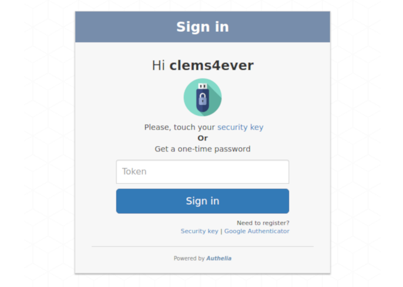

  

  [][MIT License]
  
  
  
  

**Authelia** is an open-source authentication and authorization providing
 2-factor authentication and single sign-on (SSO) for your applications.
It acts as a companion of reverse proxies by handling authentication and
authorization requests.

**Authelia** can be installed as a standalone service using Docker or NPM
but can also be deployed easily on Kubernetes. On the latest, one can
leverage ingress configuration to set up authentication and authorizations
for specific services in only few seconds.

  
  

## Features summary

Here is the list of the main available features:

* **[U2F] - Universal 2-Factor -** support with [Yubikey].
* **[TOTP] - Time-Base One Time password -** support with [Google Authenticator].
* Password reset with identity verification using email.
* Single-factor only authentication method available.
* Access restriction after too many authentication attempts.
* User-defined access control per subdomain and resource.
* Support of [basic authentication] for endpoints protected by single factor.
* High-availability using distributed database and KV store.
* Compatible with Kubernetes ingress-nginx controller out of the box.

For more details about the features, follow [Features](./docs/features.md).

## Getting Started

Follow [Getting Started](./docs/getting_started.md).

## Security

If you want more information about the security measures applied by
**Authelia** and some tips on how to set up **Authelia** in a secure way,
refer to [Security](./docs/security.md).

## Deployment

To learn how to deploy **Authelia** or use it on Kubernetes, please follow
[Deployment](./docs/deployment.md).

## Build Authelia

Follow [Build](./docs/build.md).

## Changelog

See [CHANGELOG.md](CHANGELOG.md).

## Contributors

See the list of contributors in [CONTRIBUTORS.md](CONTRIBUTORS.md).

## Donation

Wanna see more features? Then fuel me with a few beers!

## License

**Authelia** is **licensed** under the **[MIT License]**. The terms of the license are as follows:

    The MIT License (MIT)

    Copyright (c) 2016 - Clement Michaud

    Permission is hereby granted, free of charge, to any person obtaining a copy
    of this software and associated documentation files (the "Software"), to deal
    in the Software without restriction, including without limitation the rights
    to use, copy, modify, merge, publish, distribute, sublicense, and/or sell
    copies of the Software, and to permit persons to whom the Software is
    furnished to do so, subject to the following conditions:

    The above copyright notice and this permission notice shall be included in
    all copies or substantial portions of the Software.

    THE SOFTWARE IS PROVIDED "AS IS", WITHOUT WARRANTY OF ANY KIND, EXPRESS OR
    IMPLIED, INCLUDING BUT NOT LIMITED TO THE WARRANTIES OF MERCHANTABILITY,
    FITNESS FOR A PARTICULAR PURPOSE AND NONINFRINGEMENT. IN NO EVENT SHALL THE
    AUTHORS OR COPYRIGHT HOLDERS BE LIABLE FOR ANY CLAIM, DAMAGES OR OTHER LIABILITY,
    WHETHER IN AN ACTION OF CONTRACT, TORT OR OTHERWISE, ARISING FROM, OUT OF OR IN
    CONNECTION WITH THE SOFTWARE OR THE USE OR OTHER DEALINGS IN THE SOFTWARE.

[MIT License]: https://opensource.org/licenses/MIT
[TOTP]: https://en.wikipedia.org/wiki/Time-based_One-time_Password_Algorithm
[U2F]: https://www.yubico.com/about/background/fido/
[Yubikey]: https://www.yubico.com/products/yubikey-hardware/yubikey4/
[auth_request]: http://nginx.org/en/docs/http/ngx_http_auth_request_module.html
[Google Authenticator]: https://play.google.com/store/apps/details?id=com.google.android.apps.authenticator2&hl=en
[config.template.yml]: https://github.com/clems4ever/authelia/blob/master/config.template.yml
