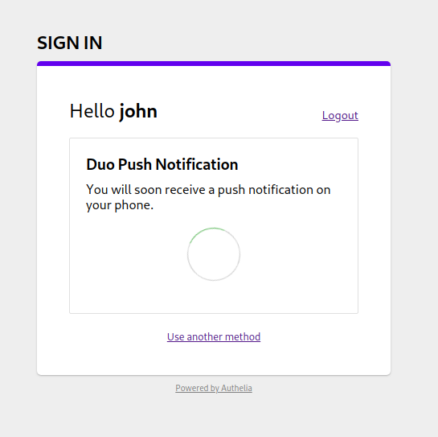

# Duo Push Notification

Using mobile push notifications is becoming the new trendy way to validate
the second factor of a 2FA authentication process. [Duo](https://duo.com/) is offering an API
to integrate this kind validation and **Authelia** leverages this mechanism
so that you can simply push a button on your smartphone to be securely granted
access to your services.

  

In order to use this feature, you should first create a free account on Duo
(up to 10 users), create a user account and attach it a mobile device. The name
of the user must match the name of the user in your internal database.
Then, click on *Applications* and *Protect an Application*. Then select the option
called *Partner Auth API*. This will generate an integration key, a secret key and
a hostname. You can set the name of the application to **Authelia** and then you
must add the generated information to your configuration as:

    duo_api:
      hostname: api-123456789.example.com
      integration_key: ABCDEF
      secret_key: 1234567890abcdefghifjkl

This can be seen in [config.template.yml](../../config.template.yml) file.

When selecting *Duo Push Notification* at the second factor stage, you will
automatically receive a push notification on your phone to grant or deny access.

  
  

## Limitations

Users must be enrolled via the Duo Admin panel, they cannot enroll a device from
**Authelia** yet.

## FAQ

### Why don't I have access to the *Duo Push Notification* option?

It's likely that you have not configured **Authelia** correctly. Please read this
documentation again and be sure you had a look at [config.template.yml](../../config.template.yml).