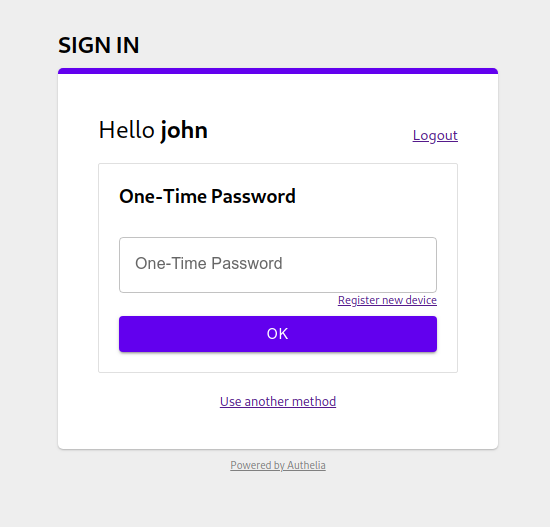
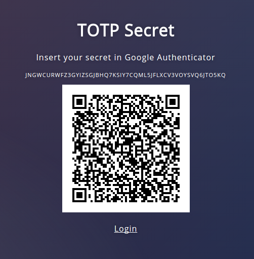

# One-Time Passwords

In **Authelia**, your users can use [Google Authenticator] for generating unique
tokens that they can use to pass the second factor.

  

Select the *One-Time Password method* and click on the *register new device* link.
Then, check the email sent by **Authelia** to your email address
to validate your identity. If you're testing **Authelia**, it's likely
that this e-mail has been sent to https://mail.example.com:8080/

Confirm your identity by clicking on **Continue** and you'll get redirected
on a page where your secret will be displayed as QRCode and in Base32 formats.

  

You can use [Google Authenticator] to store it.

From now on, you'll get generated
tokens from your phone that you can use to validate the second factor in **Authelia**.

[Google Authenticator]: https://play.google.com/store/apps/details?id=com.google.android.apps.authenticator2&hl=en