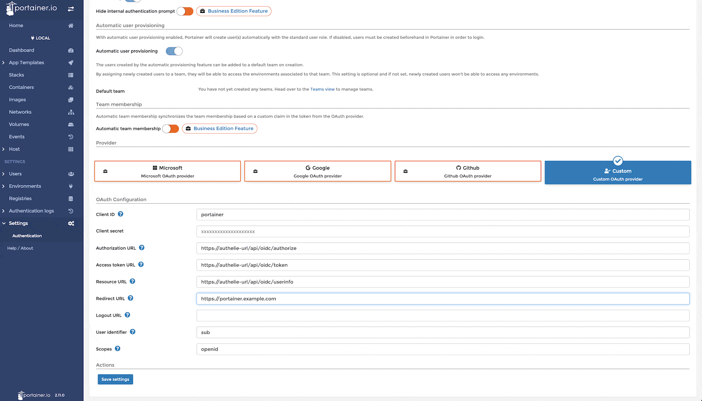

# OIDC Integrations: Portainer

{{ page.path }}

**Note** these setting have been tested with authelia `v4.33.2` and Portainer-CE `2.11.0`

## Authelia config

The specific client config for portainer.

```yaml
identity_providers:
  oidc:
    clients:
      - id: portainer_client_id
        description: Some description you want to shown on the Authelia consent page
        secret: some secret string which should also be entered in the portainer config
        public: false
        authorization_policy: two_factor
        audience: []
        scopes:
          - openid
        redirect_uris:
          - https://portainer.example.com
        userinfo_signing_algorithm: none
```

## Portainer config

To setup Authelia as SSO provider in portainer go to **Settings > Authentication** and select **Authentication method** OAuth and **Provider** Custom and make sure automatic user provision is turned so users get automatically created.

**Note** make sure that Redirect URL matches exacty the redirect_uris in authelia config. Also us `preferred_username` as the User identifier which makes sure the portianer user and authelia user have the same username.

<p align="center">
  <a href="../../images/portainer.gif" target="_blank"></a>
</p>