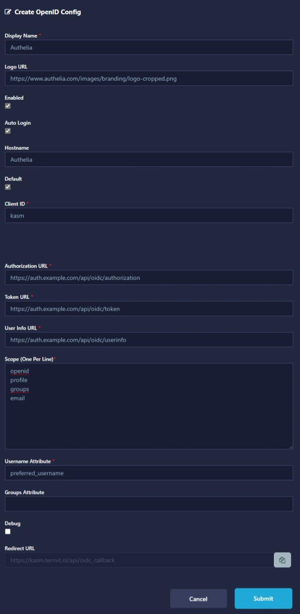

## Tested Versions

* [Authelia]
  * [v4.37.5](https://github.com/authelia/authelia/releases/tag/v4.37.5)
* [Kasm Workspaces]
  * [1.13.0](https://kasmweb.com/docs/latest/release_notes/1.13.0.html)

## Before You Begin

{}

### Assumptions

This example makes the following assumptions:

* __Application Root URL:__ `https://kasm.example.com`
* __Authelia Root URL:__ `https://auth.example.com`
* __Client ID:__ `kasm`
* __Client Secret:__ `insecure_secret`

## Configuration

### Application

To configure [Kasm Workspaces] to utilize Authelia as an [OpenID Connect 1.0] Provider use the following configuration:



### Authelia

The following YAML configuration is an example __Authelia__
[client configuration](../../../configuration/identity-providers/open-id-connect.md#clients) for use with
[Kasm Workspaces] which will operate with the above example:

```yaml
identity_providers:
  oidc:
    ## The other portions of the mandatory OpenID Connect 1.0 configuration go here.
    ## See: https://www.authelia.com/c/oidc
    clients:
      - id: kasm
        description: Kasm Workspaces
        secret: '$pbkdf2-sha512$310000$c8p78n7pUMln0jzvd4aK4Q$JNRBzwAo0ek5qKn50cFzzvE9RXV88h1wJn5KGiHrD0YKtZaR/nCb2CJPOsKaPK0hjf.9yHxzQGZziziccp6Yng'  # The digest of 'insecure_secret'.
        public: false
        authorization_policy: two_factor
        redirect_uris:
          - https://kasm.example.com/api/oidc_callback
        scopes:
          - openid
          - profile
          - groups
          - email
        consent_mode: implicit
        userinfo_signing_algorithm: none
```

## See Also

* [Kasm Workspaces OpenID Connect Authentication Documentation](https://kasmweb.com/docs/latest/guide/oidc.html)

[Authelia]: https://www.authelia.com
[Kasm Workspaces]: https://kasmweb.com/
[OpenID Connect 1.0]: ../../openid-connect/introduction.md
