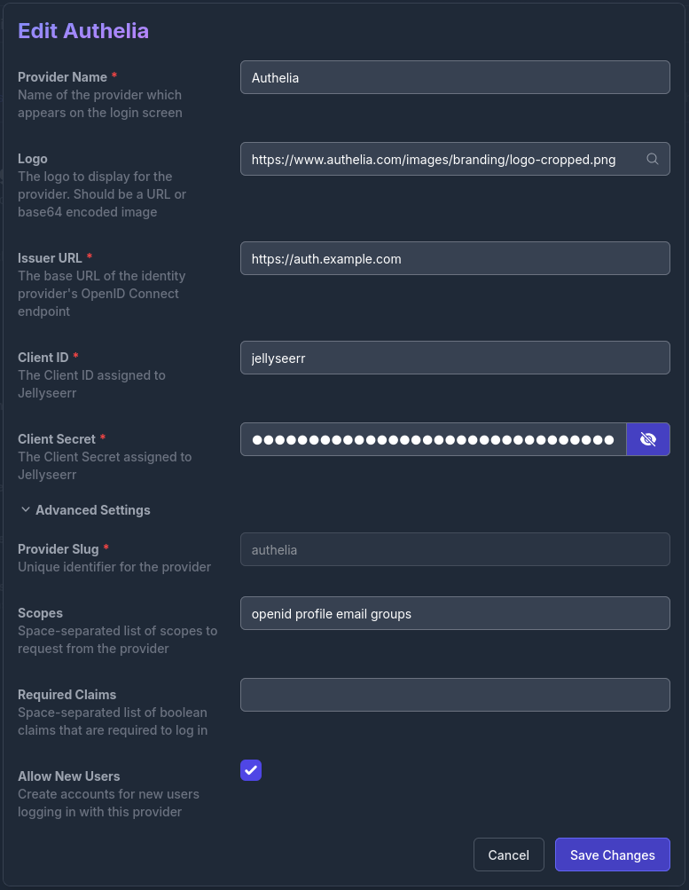

## Tested Versions

- [Authelia]
  - [v4.39.7](https://github.com/authelia/authelia/releases/tag/v4.39.7)
- [Jellyseerr]
  - [development version tag:preview-OIDC](https://github.com/fallenbagel/jellyseerr/releases/tag/preview-OIDC)

{}

### Assumptions

This example makes the following assumptions:

- __Application Root URL:__ `https://jellyseerr./`
- __Authelia Root URL:__ `https://./`
- __Client ID:__ `jellyseerr`
- __Client Secret:__ `insecure_secret`

Some of the values presented in this guide can automatically be replaced with documentation variables.



### Authelia

The following YAML configuration is an example __Authelia__ [client configuration] for use with [Jellyseerr] which will
operate with the application example:

```yaml {title="configuration.yml"}
identity_providers:
  oidc:
    ## The other portions of the mandatory OpenID Connect 1.0 configuration go here.
    ## See: https://www.authelia.com/c/oidc
    clients:
      - client_id: 'jellyseerr'
        client_name: 'Jellyseerr'
        client_secret: '$pbkdf2-sha512$310000$c8p78n7pUMln0jzvd4aK4Q$JNRBzwAo0ek5qKn50cFzzvE9RXV88h1wJn5KGiHrD0YKtZaR/nCb2CJPOsKaPK0hjf.9yHxzQGZziziccp6Yng'  # The digest of 'insecure_secret'.
        public: false
        authorization_policy: 'two_factor'
        redirect_uris:
          - 'https://jellyseerr./login/oidc/callback/authelia'
        scopes:
          - 'openid'
          - 'email'
          - 'profile'
          - 'groups'
        token_endpoint_auth_method: 'client_secret_post'
```

### Application

The following instructions will guide you through the UI-based configuration of [Jellyseerr] to utilize Authelia as an OpenID Connect 1.0 Provider.

1. Go to the `Settings page` from the left-hand navigation in [Jellyseerr].
2. Under the `Users` tab, you should see "Enable OpenID Connect Sign-In", if you are on the correct branch.
   
3. Click the Cog icon next to "Enable OpenID Connect Sign-In" then select `Add OpenID Connect Provider`.
4. Configure the following options:
   - Provider Name: `Authelia`
   - Logo: `https://www.authelia.com/images/branding/logo-cropped.png`
   - Issuer URL: `https://.`
   - Client ID: `jellyseerr`
   - Client Secret: `insecure_secret`
   - Scopes: `openid,profile,email,groups`
   - Allow New Users: Checked
   
5. All other options may remain unchecked or unconfigured.
6. Click `Save Changes`.
7. Click `Close` to return to the Settings page.
8. Ensure the `Enable OpenID Connect Sign-In` option is checked
9. Scroll down to the bottom of the page and click `Save Changes`.
10. To log in visit `https://jellyseerr./api/v1/auth/oidc/login/authelia`.

A login button is also added to the Jellyseerr login page, which will redirect to Authelia for authentication.


## See Also

- [OIDC Feature Discussion on GitHub](https://github.com/fallenbagel/jellyseerr/discussions/1529)

[Authelia]: https://www.authelia.com
[Jellyseerr]: https://github.com/fallenbagel/jellyseerr
[client configuration]: ../../../configuration/identity-providers/openid-connect/clients.md
