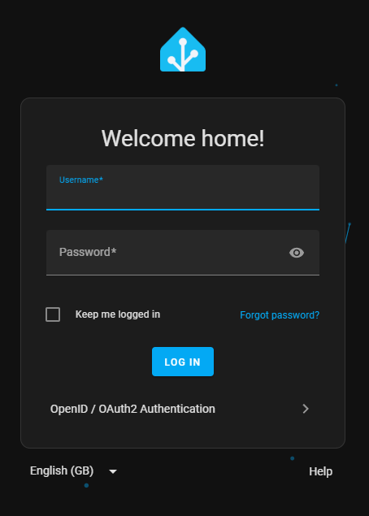

## Tested Versions

- [Authelia]
  - [v4.39.4](https://github.com/authelia/authelia/releases/tag/v4.39.4)
- [Home Assistant]
  - Application:
    - [v2025.5.3](https://github.com/home-assistant/core/releases/tag/2025.5.3)
  - Integration `hass-openid`:
    - [1.1.4](https://github.com/cavefire/hass-openid/releases/tag/1.1.4)

{}

### Assumptions

This example makes the following assumptions:

- __Application Root URL:__ `https://home-assistant./`
- __Authelia Root URL:__ `https://./`
- __Client ID:__ `home-assistant`
- __Client Secret:__ `insecure_secret`

Some of the values presented in this guide can automatically be replaced with documentation variables.



## Configuration

The following example uses the [OIDC Integration for Home Assistant] which is assumed to be installed with
[HACS](https://hacs.xyz/) when following this section of the guide.

### Authelia

The following YAML configuration is an example __Authelia__ [client configuration] for use with [Home Assistant] which will
operate with the application example:

```yaml {title="configuration.yml"}
identity_providers:
  oidc:
    ## The other portions of the mandatory OpenID Connect 1.0 configuration go here.
    ## See: https://www.authelia.com/c/oidc
    clients:
      - client_id: 'home-assistant'
        client_name: 'Home Assistant'
        client_secret: '$pbkdf2-sha512$310000$c8p78n7pUMln0jzvd4aK4Q$JNRBzwAo0ek5qKn50cFzzvE9RXV88h1wJn5KGiHrD0YKtZaR/nCb2CJPOsKaPK0hjf.9yHxzQGZziziccp6Yng'  # The digest of 'insecure_secret'.
        public: false
        require_pkce: false
        authorization_policy: 'two_factor'
        redirect_uris:
          - 'https://home-assistant./auth/openid/callback'
        scopes:
          - 'email'
          - 'openid'
          - 'profile'
          - 'groups'
        userinfo_signed_response_alg: 'none'
        token_endpoint_auth_method: 'client_secret_post'
```

### Application

To configure [Home Assistant] there is one method, using the [Configuration File](#configuration-file).

Users must already exist in Home Assistant before they can log in, as the integration does not support user registration.

#### Configuration File


Generally the configuration file is named `configuration.yaml`.


To configure [Home Assistant] to utilize Authelia as an [OpenID Connect 1.0] Provider, use the following configuration:

```yaml {title="configuration.yaml"}
openid:
  client_id: 'home-assistant'
  client_secret: 'insecure_secret'
  configure_url: 'https://./.well-known/openid-configuration'
  username_field: "email"
  scope: "email openid profile groups"
  block_login: false
```

Once you have configured Home Assistant and have tested your configuration, you can change the `block_login` value to
`true` to prevent users from logging in via username and password, instead they will be automatically redirected to Authelia.



## See Also

- [OIDC Integration for Home Assistant Docs](https://github.com/cavefire/hass-openid)

[Home Assistant]: https://www.home-assistant.io/
[OIDC Integration for Home Assistant]: https://github.com/cavefire/hass-openid
[Authelia]: https://www.authelia.com
[OpenID Connect 1.0]: ../../openid-connect/introduction.md
[client configuration]: ../../../configuration/identity-providers/openid-connect/clients.md
