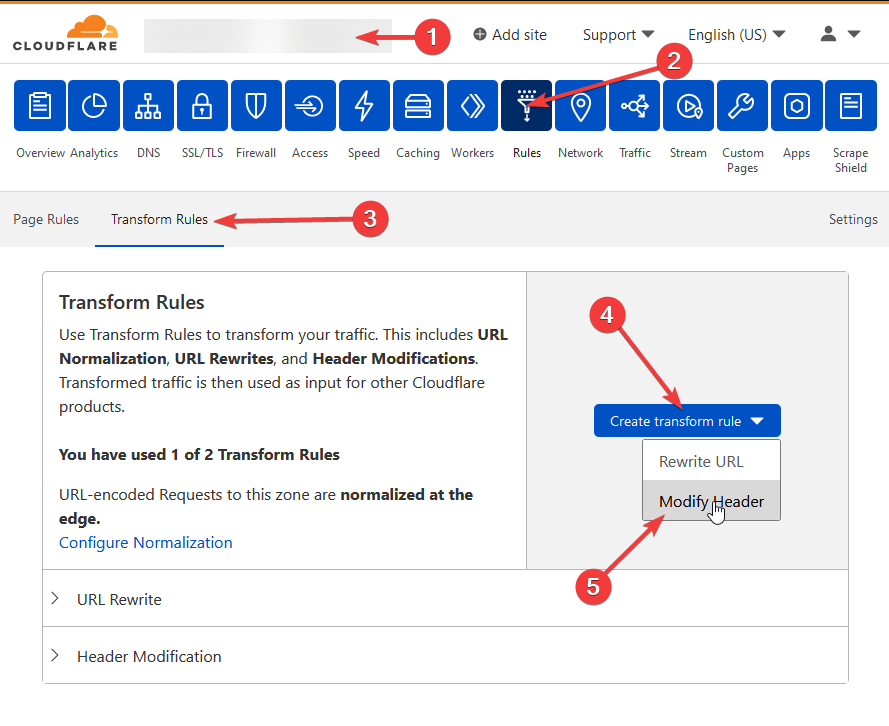
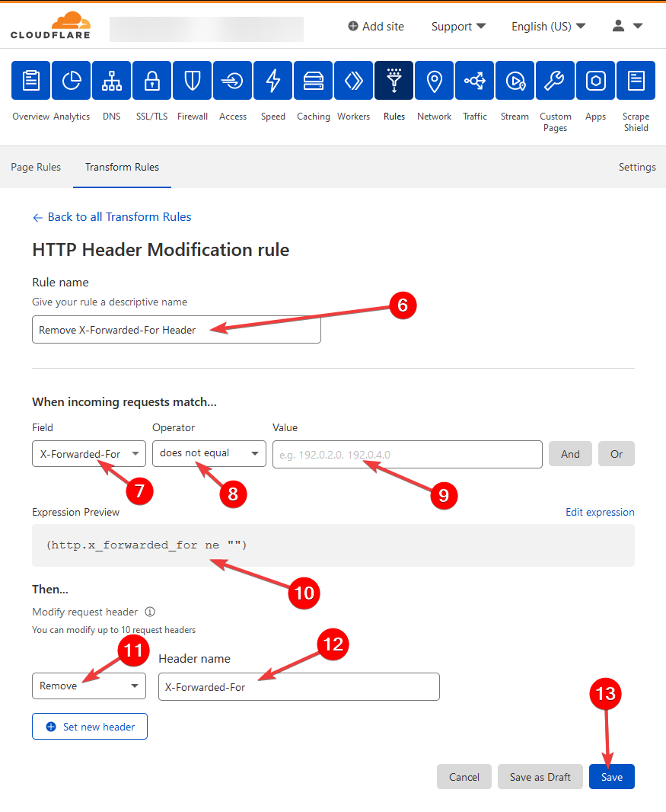

[Cloudflare] is a popular DNS provider that also provides a proxy service which is commonly used to hide actual IP
addresses and provide certain caching features to speed up load times. While it is not supported directly as a proxy
by Authelia, you must ensure [Cloudflare] is configured correctly for the following reasons:

1. It is supported to use the [Cloudflare] proxy in front of the proxy configured to utilize Authelia.
2. In order to get the real remote IP address of the user when they're outside your network you must trust the 
   X-Fowarded-For headers from [Cloudflare].
   1. _**Note:** you may also use the `CF-Connecting-IP` to configure the [X-Forwarded-For] header, however it must
      completely overwrite the [X-Forwarded-For] header, and we still strongly recommend setting this rule regardless_.
3. If you do not configure [Cloudflare] correctly [Cloudflare]'s proxy will blindly trust **any** [X-Forwarded-For] header
   sent by clients.

## IP Ranges

[Cloudflare]'s proxy IP ranges are published on their [website](https://www.cloudflare.com/ips/). You should ensure if
you are using [Cloudflare] that you configure your proxy to trust these IP's as sources for the [X-Forwarded-For] header
so that it doesn't strip it. It's also _**critical**_ that you do not just blindly trust [X-Forwarded-For] and strip it from
any request from a source that is not trusted.

## Remove X-Forwarded-For

You can remove the [X-Forwarded-For] header using Cloudflare's rules section. _**This is important** when you are using
network access control rules in Authelia, and using the `Proxied` option in the DNS section **for any domain protected
by Authelia**_.

1. Select the domain you're specifically wanting to configure.
2. Select `Rules` in the top middle.
3. Select `Transform Rules`.
4. Select `Create transform rule`.
5. Select `Modify Header`.
6. Name it what ever you like, our suggestion is `Remove X-Forwarded-For Header`.
7. Click the dropdown for `Field` and select `X-Forwarded-For`.
8. Click the dropdown for `Operator` and select `does not equal`. 
9. Leave `Value` blank.
10. Check your expression looks like this in the `Expression Preview` section: `(http.x_forwarded_for ne "")`
11. In the `Then...` section click the dropdown, and choose `Remove`.
12. Set the `Header Name` to exactly `X-Forwarded-For`.
13. Click Save.

  

  

[Cloudflare]: https://www.cloudflare.com/
[X-Forwarded-For]: https://developer.mozilla.org/en-US/docs/Web/HTTP/Headers/X-Forwarded-For