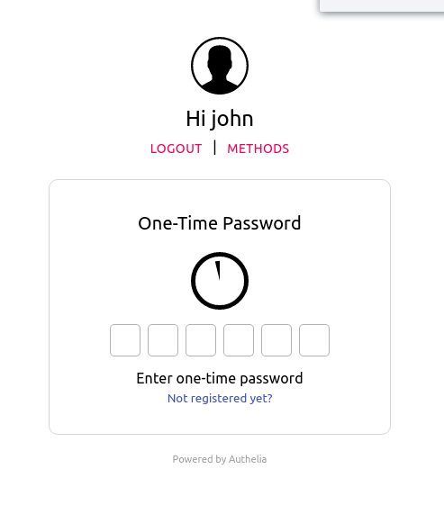

# Time-based One-Time Password

**Authelia** supports Time-base one-time password generated by apps like [Google Authenticator].

  
  

After having successfully completed the first factor, select **One-Time Password method**
option and click on **Register device** link. This will e-mail you to confirm your identity.

*NOTE: If you're testing **Authelia**, this e-mail has likely been sent to the mailbox available at https://mail.example.com:8080/*

Once this validation step is completed, a QR Code gets displayed.

  

You can then use [Google Authenticator] to scan the code in order to register your device.

From now on, you get tokens generated every 30 seconds that
you can use to validate the second factor in **Authelia**.

## Limitations

Users currently can only enroll a single TOTP device in **Authelia**.
Multiple single type device enrollment will be available when [this issue](https://github.com/authelia/authelia/issues/275) has been resolved.

[Google Authenticator]: https://google-authenticator.com/
