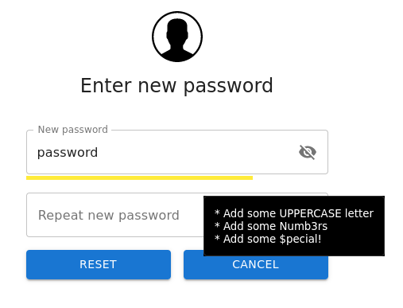

# Password Policy
Password policy enforces the security by requering the users to use strong passwords
Currently, two methods are supported:
## classic
* this mode of operation allows administrators to set the rules that user passwords must comply with
* the available options are: 
    * Minimum password length
    * Require Uppercase
    * Require Lowercase
    * Require Numbers
    * Require Special characters
* the password entered by the user must meet these rules 

  

## zxcvbn
* this mode uses zxcvbn for password strength checking (see: https://github.com/dropbox/zxcvbn)
* in this mode of operation, the user is not forced to follow any rules. the user is notified if their passwords is weak or strong

  

