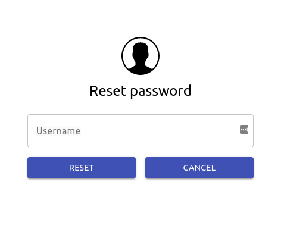
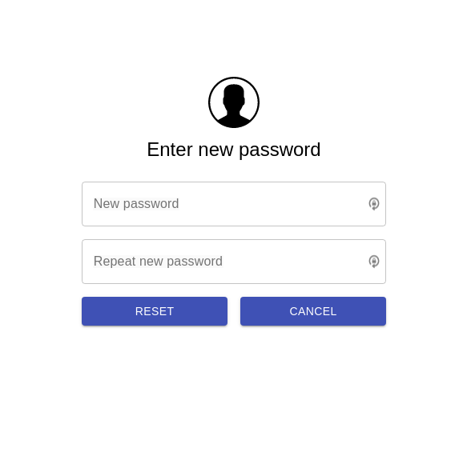

# Password Reset

**Authelia** provides workflow to let users reset their password when they lose it.

A simple click on `Forgot password?` for starting the process. Note that resetting a
password requires a new identity verification using the e-mail of the user.

  

Give your username and receive an e-mail to verify your identity.

  

Once your identity is verified, fill in the form to reset your password.

  

Now you can authenticate with your new credentials.