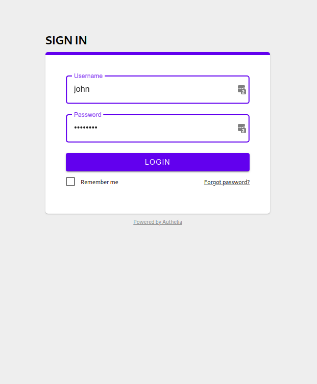

# Getting Started

**Authelia** can be tested in a matter of seconds with docker-compose based
on the latest image available on [Dockerhub].

In order to deploy the latest release locally, run the following command and
follow the instructions of bootstrap.sh:

    source bootstrap.sh

Then, start the *dockerhub* [suite].

    authelia-scripts suites start dockerhub

A [suite] is kind of a virtual environment for running Authelia.
If you want more details please read the related [documentation](./suites.md).

## Test it!

After few seconds the services should be running and you should be able to
visit [https://home.example.com:8080/](https://home.example.com:8080/).

When accessing the login page, since this is a test environment a
self-signed certificate exception should appear, it has to be trusted
before you can get to the home page.
The certificate must also be trusted for each subdomain, therefore it is
normal to see this exception several times.

Below is what the login page looks like after you accepted all exceptions:

  

You can use one of the users listed in [https://home.example.com:8080/](https://home.example.com:8080/).
The rights granted to each user and group is also provided in the page as
a list of rules.

At some point, you'll be required to register your second factor device.
Since your security is **Authelia**'s priority, it will send 
an email to the email address of the user to confirm the user identity.
Since we're running a test environment, we provide a fake webmail called
*MailCatcher* from which you can checkout the email and confirm
your identity.
The webmail is accessible from
[http://mail.example.com:8080](http://mail.example.com:8085).

Enjoy!

## FAQ

### What version of Docker and docker-compose should I use?

Here are the versions used for testing in Travis:

    $ docker --version
    Docker version 17.03.1-ce, build c6d412e

    $ docker-compose --version
    docker-compose version 1.14.0, build c7bdf9e

### How am I supposed to access the subdomains of example.com?

Well, in order to test Authelia, Authelia fakes your browser by adding entries
in /etc/hosts when you first source the bootstrap.sh script.

### What should I do if I want to contribute?

You can refer to the dedicated documentation [here](./build-and-dev.md).

[config.template.yml]: ../config.template.yml
[DockerHub]: https://hub.docker.com/r/clems4ever/authelia/
[suite]: ./suites.md